<h1>GASMI MANAL</h1>
<h2>Activité 2: Développement d'un Micro Service avec un Web service RESTfull et GraphQL  </h2>

<h3> Test de H2 console</h3>
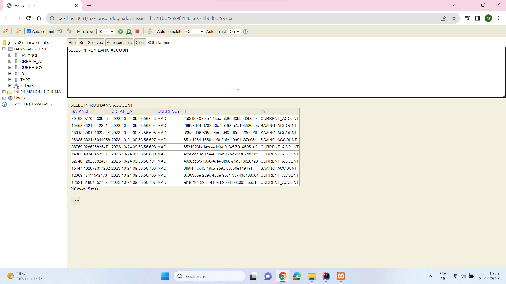
<h3>Test de la couche DAO</h3>
<h2>Récuperer la liste des comptes bancaires</h2>
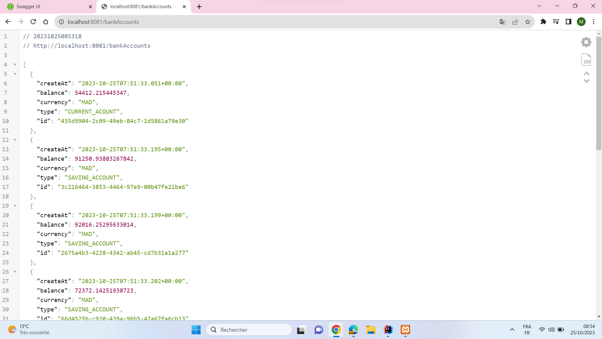
<h2>Récuperer un compte bancaire précis</h2>
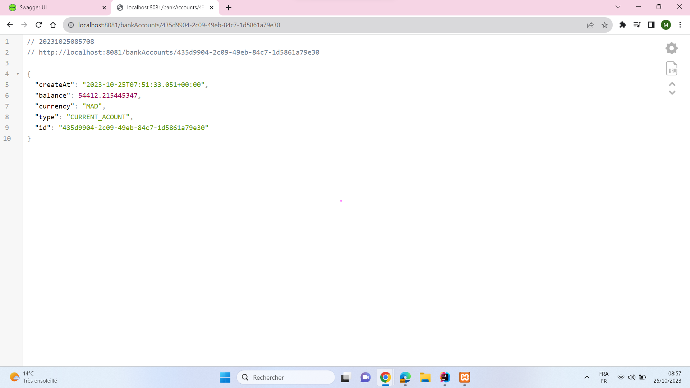
<h3>Test du web micro-service en utilisant un client REST Postman</h3>
<h2>Requete pour récuperer la liste des comptes</h2>
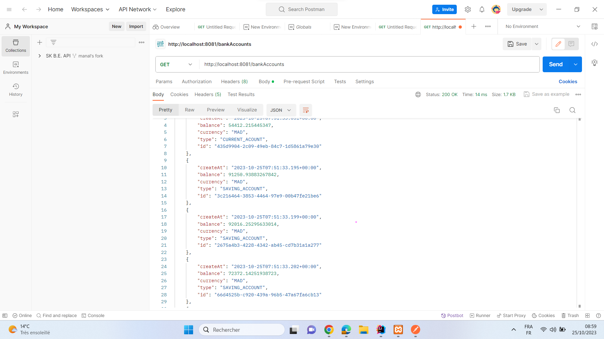
<h2>Requete pour ajouter un compte bancaire </h2>
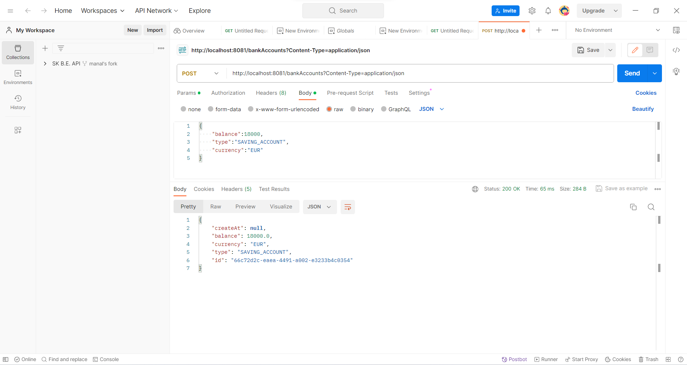
<h2>Requete pour modifier un compte bancaire précis</h2>
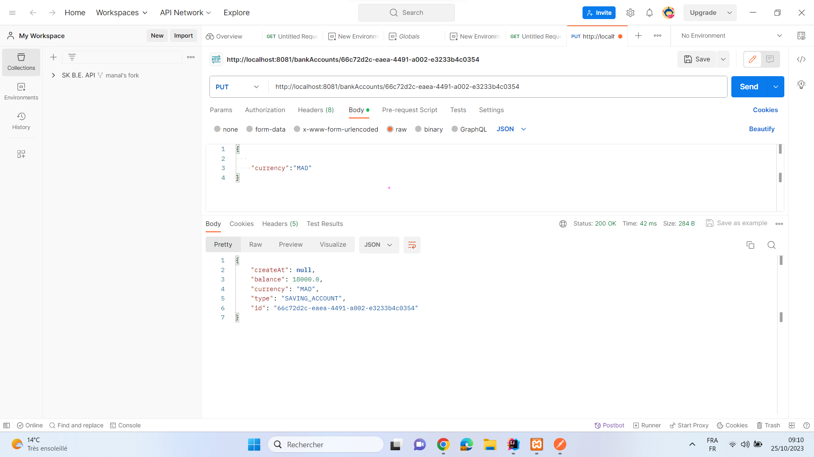
<h3>OpenApi definition</h3>

<h2>Test de requete d'ajout d'un compte bancaire</h2>
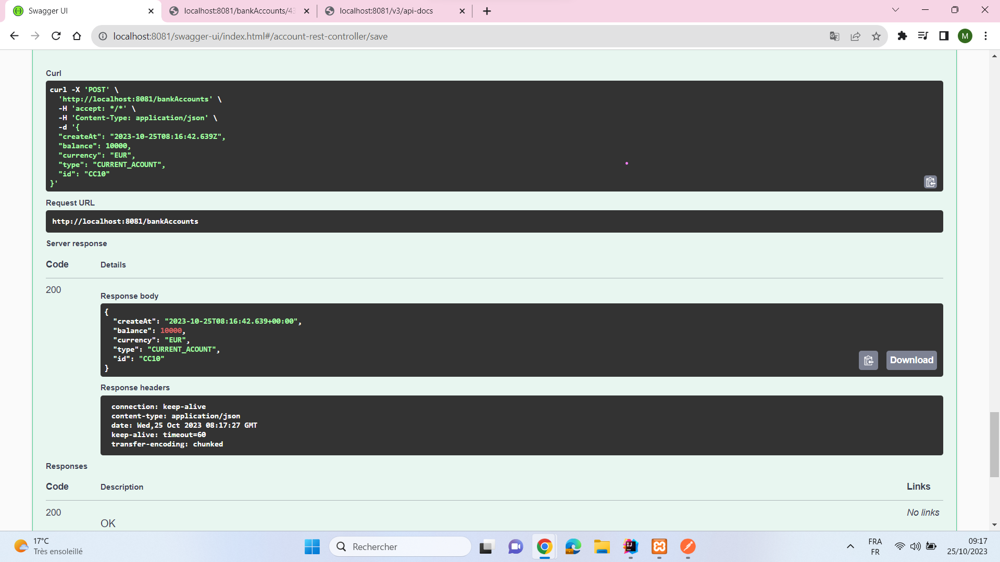
<h2>Consulter un compte bancaire en fournissant son ID</h2>

<h3>Exposition d'une API Restful en utilisant Spring Data Rest en exploitant des projections</h3>

<h2>Recherche par type de compte</h2>
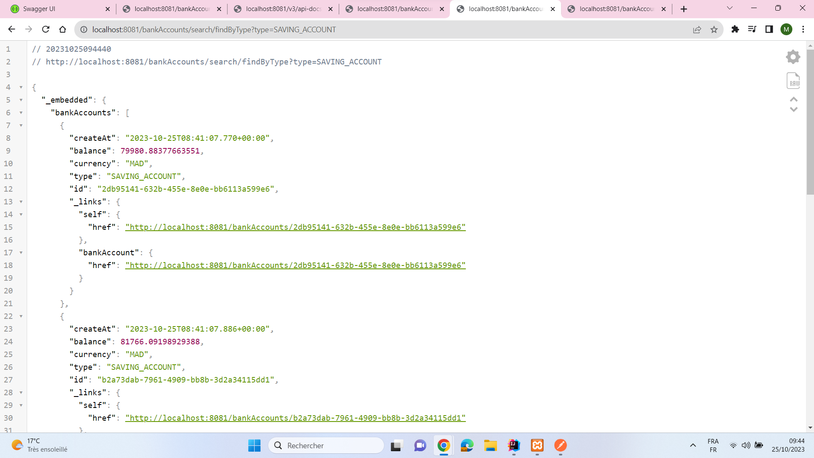
<h1>Web service GraphQL </h1>
<h2>La liste des comptes bancaires</h2>

<h2>Récuperer un compte bancaire par son ID</h2>
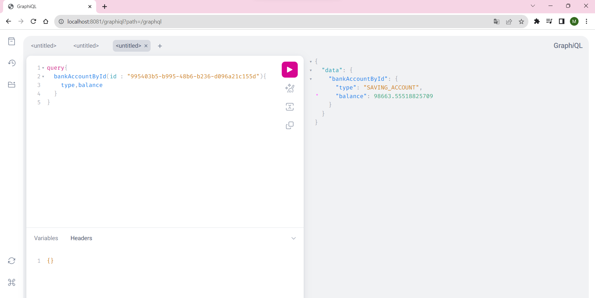
<h2>Ajouter un compte bancaire</h2>

<h2>Modifier un compte bancaire</h2>

<h3>Mise à jour au niveau de la base de donnée et l'ajout de la table client avec la création des relations entre cette dérniere et la table compte bancaire </h3>
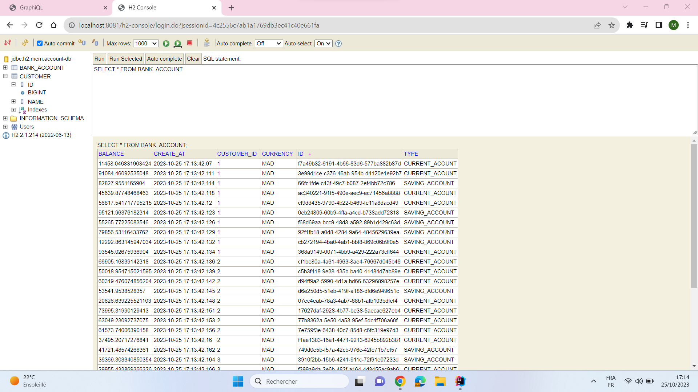
<h2>Récupération des comptes bancaires des clients</h3>
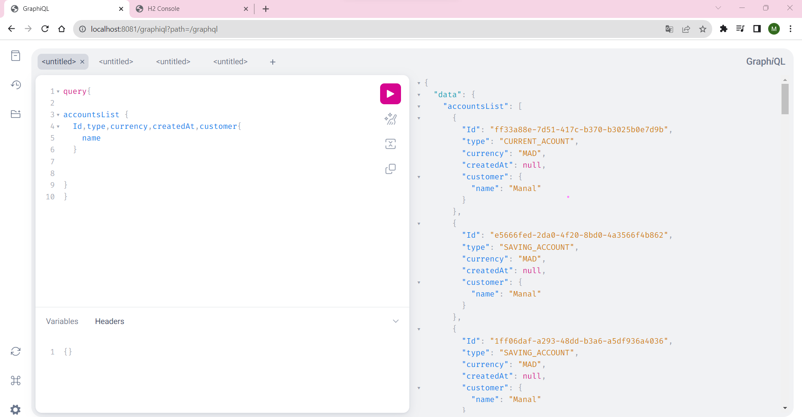
